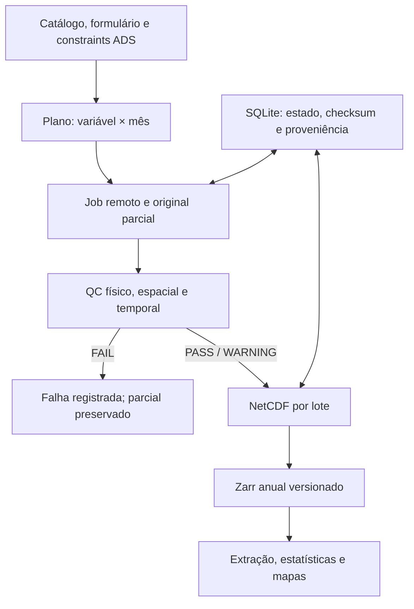

# Arquitetura e decisões



## Fronteiras

- `catalog.py`: descobre links oficiais e verifica combinações válidas. A interseção
  de collection extent, variável, nível, produto e período evita inferir todos os
  meses de um ano apenas porque o seletor contém esse ano.
- `requests.py`: lotes determinísticos com SHA256 do dataset/request. O hash inclui
  área, nível e formato para impedir colisões e reutilização da região errada.
- `storage.py`: manifesto transacional SQLite/WAL, histórico de eventos e checksums.
- `downloader.py`: jobs persistidos, polling com deadline, transferências retomáveis,
  backoff, orçamento de disco, lock por lote, rename atômico após QC.
- `validation.py`: decodificação GRIB/NetCDF/ZIP, semântica de nível/tempo, grade,
  intervalos completos, NaN/Inf, identidades e relatórios PASS/WARNING/FAIL.
- `units.py` e `metadata.py`: conversões e rastreabilidade explícitas.
- `processing.py`: derivados NetCDF e gerações imutáveis de Zarr; índice transacional.
- `extraction.py`, `statistics.py`, `maps.py`, `analysis.py`: consumidores independentes
  do mecanismo de aquisição, preparados para uso posterior por uma API.

## Layout físico

```text
data/raw/eac4/{monthly|subdaily}/{variable}/{year}/{month}/
    {variable}_{year-month}_{request-hash}.{grib|zip}
data/interim/unpacked/{payload-checksum}/
data/processed/eac4/{monthly|subdaily}/{variable}/{year}/
    {month}_{request-hash}_{processing-signature}.nc
data/processed/eac4/{monthly|subdaily}/zarr/{scope-hash}/
    {year}-{content-generation}.zarr
    index.json
```

Originais nunca são substituídos por conversões. Um payload corrompido ou com
checksum alterado é preservado com sufixo `.corrupt-*`. Não é sobrescrito um
original já validado e inalterado. Um arquivo completo sem commit SQL é revalidado
para recuperação após interrupção. Estados não bastam: o tamanho e SHA256 são
checados ao reutilizar o arquivo.

## Zarr e integridade de publicação

Cada ano reúne as variáveis configuradas com `join='exact'`. Divergências de grade,
timestamps ou cobertura entre variáveis geram erro, não preenchimento silencioso.
As coordenas de tempo mensais passam a início do mês; `time_bnds` documenta o
intervalo. A extensão regional e a lista de variáveis compõem o namespace do índice.

Um ano alterado gera outra pasta, escrita temporariamente e publicada com rename.
Só após sucesso o `index.json` é trocado. Não há append concorrente a um único
Zarr multidecenal. Versões antigas permitem rollback e não são automaticamente
apagadas. `open_database()` segue apenas o índice atual, abre lazily e recusa
lacunas temporais por padrão. `allow_gaps=True` é opção explícita para inspeção,
não usada pela análise padrão. Não se juntam datasets EAC4 e operacionais.

Os chunks padrão `(1,121,120)` equivalem a aproximadamente 58 KiB float32 por
variável/chunk. São conservadores para processamento/mapas mensais e limitam a
memória. Para séries temporais repetidas, aumentar `time` para 12 no mensal pode
melhorar leitura; para subdiários, avaliar 8–32 após benchmark. Exact percentiles
reúnem somente o eixo temporal por bloco espacial e destinam-se à série mensal.
Um Zarr subdiário com time=1 gera muitos objetos; em produção, ajuste para 8/16
antes de consolidar. NetCDF continua sendo a camada interoperável por mês.

## Falhas e concorrência

Concorrência 1 por padrão, máximo 4 workers configuráveis em processos separados.
Isso evita acesso HDF5/netCDF concorrente em threads do mesmo processo. SQLite
transaciona alterações curtas. Um lock de escrita protege o índice Zarr e locks
por payload protegem duplicação de trabalho local. Rede pode repetir chamadas;
a submissão ADS não oferece aqui transação distribuída exatamente-uma-vez.

Uma URL assinada é efêmera e não entra em logs ou metadados. A retomada grava
apenas hash da URL, tamanho e ETag. Se a URL muda, reinicia aquele parcial; se o
asset suporta Range, valida Content-Range. Resultados só passam de downloaded
para validated depois da abertura e do QC completo.

## Extensões futuras

API FastAPI consumindo `open_database` e as funções de extração; cache de séries
em Parquet; PostGIS para fronteiras administrativas e índices de células; dashboard
sem executar downloads ADS em callbacks web; meteorologia com alinhamento de
células/níveis/tempos explícito; análises epidemiológicas com plano de exposição,
validação e controle de confundimento. São interfaces propostas, não serviços já publicados.

## Backends e isolamento de mapas

O formato científico de saída é NetCDF4/HDF5. O backend padrão é `h5netcdf`,
com teste de leitura independente por `netCDF4`; o formato não foi trocado.
Parquet usa `fastparquet` com teste de ida e volta de timestamps, números e NaN.
A renderização Cartopy/PROJ roda em `map_worker.py`, em outro processo, recebendo
um único campo NumPy sem pickle. O PNG só é movido atomicamente ao destino após
exit code 0. Isso evita misturar a vida útil das bibliotecas nativas de projeção
com a das bibliotecas de dados no processo principal. Limites das células são
explícitos, polos limitados a ±90°, sem duplicar colunas globais.
